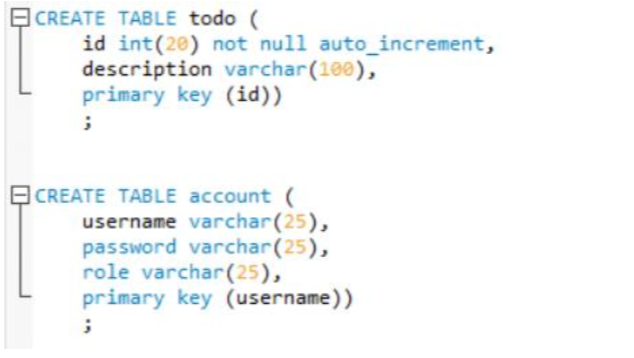
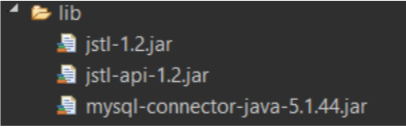
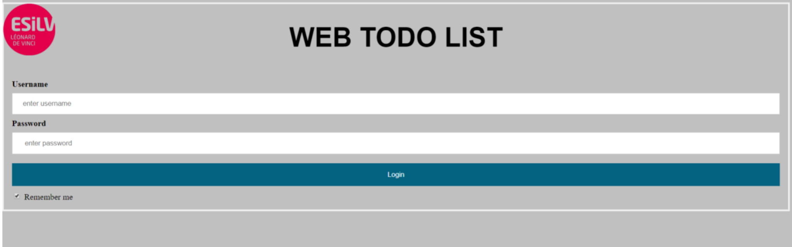
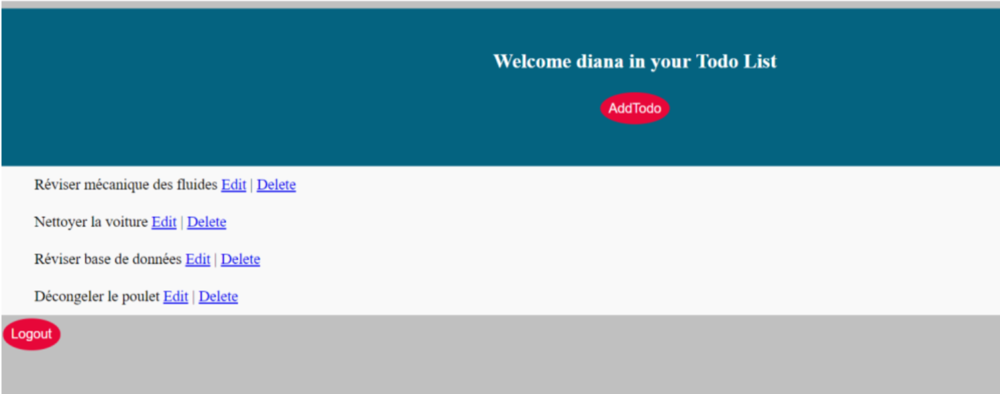

# 💻 Web_Todo_List 💻

## Description :

 WebTodoList » is a dynamic web application that allows an instructor to put online a todo list for his students and allows the students to access this todo list.
The instructor can access the web site to create, edit or delete some todos.The students can only consult the todo list prepared by the instructor.
To make simple, we will suppose that a todo is only caracterized by an « id » and a « description ».
To save the todos, we use a MySQL database. To access the application, a login system is in use. The instructor and all of his students have user accounts in the database. An account is defined by a username, a password and a role (instructor or student).

## How it works ?

Once the url of the web site is entered, a login page is displayed. A user having an account can enter his username and his password before pressing a Login button. The web server verifies his account and if it is not a valid user, an error message is displayed.
In case of validation, two scenarios are possible :
1. The user is the instructor : He can access the latest list of todos and update it.
2. The user is a student : he can just access the latest list of todos.
At any moment, a user can logout and the login page is displayed again.
After the first login of a user, the web site creates a cookie for the username so that the username is automatically filled in later logins.
Once the user is logged in, the server saves his username in a session, and displays it in a welcome message. This message should be displayed in all visited pages.

## 🏃‍♀️ Steps done

### Step 1 : SQL Database

 

### Step 2 : Server

To make a link between eclipse our IDE and our dynamic web application I used “Tomcat” an open source implementation of the Java Servlet, JavaServer Pages, Java Expression Language and Java WebSocket technologies.

### Step 3 : Library and packages requirements

 

## Demo

 

 

